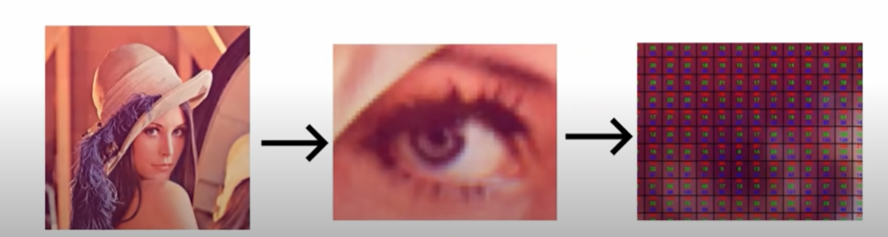
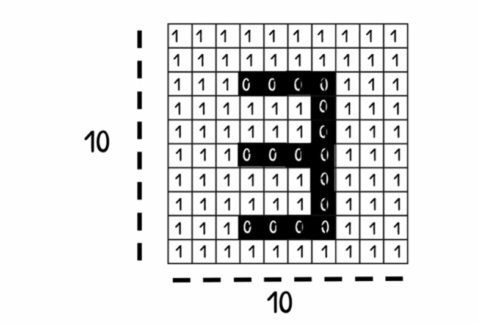
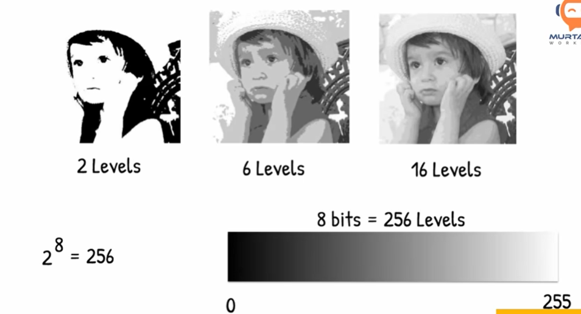
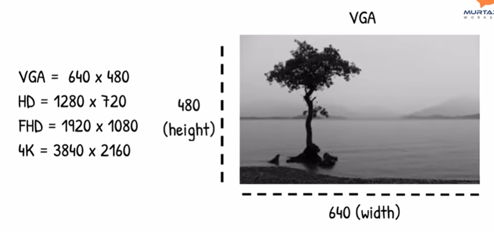
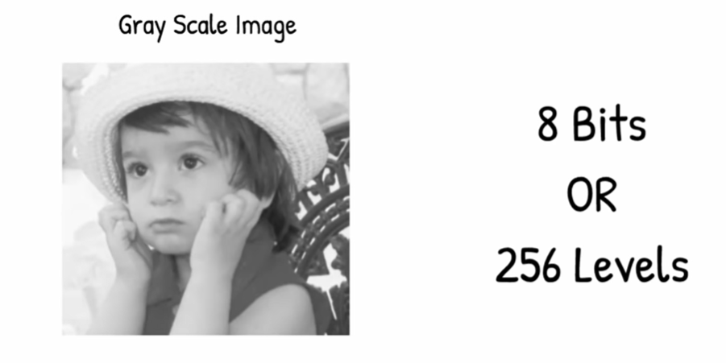
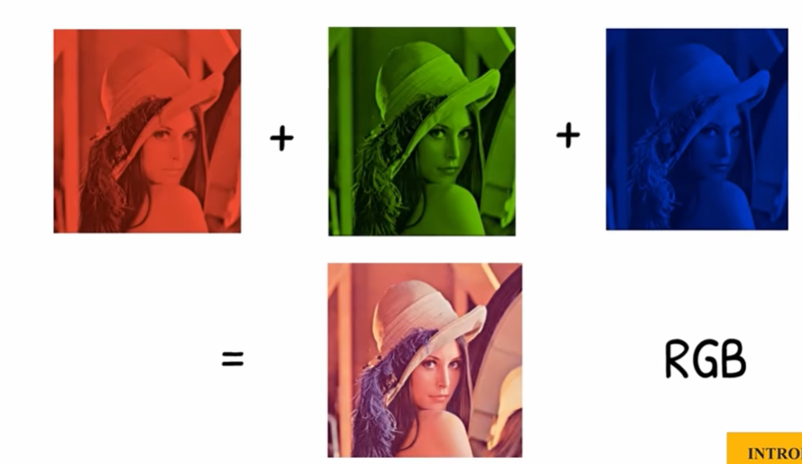
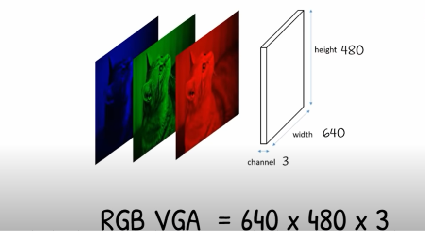
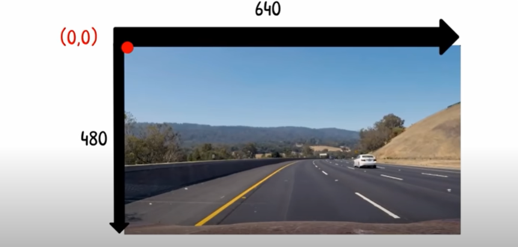

# Opencv

Dans cette formation, nous allons découvrir les fondamentaux de OpenCV,
nous allons voir comment detecter la couleur, les contours des images, ...

## Programme De La Formation

Introduction à l'installation des images

1. Lecture des images et vidéos
2. Les fonctions basiques de openCV
3. Le redimensionnement et le recadrage(cropping) des images
4. La manipulation des formes(figures) et textes
5. warp perspective(déformer la perspective)
6. La jointure des images(joining images)
7. La detection des couleurs
8. Contour / detection des formes
9. Detection faciale

## Projets

1. Paint virtuel
2. Scannage des Documents
3. La detection des plaque d'immatriculation

## Introduction Aux Images

* Au fait les ordinateurs voient des images comme des chiffres de de 0 ou de 1 et  8bit autrement dit de 0 à 255 niveaux de nuances.

ou 

## Des Normes

Nous avons aussi des normes normes d'affichages des images c'est à dire qui codent des sur plusieurs bits:
* VGA
* HD
* FHD
* 4K

## Types d'Images

Nous avons également des images en gris ou en couleur: 
* Images en gris: qui sont codées sur 8bits (0 à 255) et constituées d'une seule couche.

  
  

* Images en couleur: qui sont codées sur 8bits (0 à 255) et constituées de 3 couches.

  * **RGB**
  
    

  * **RGB VGA**
  
    

## Installation d'OpenCV

* de préference installer Python 3.7
  [https://www.python.org/downloads/](https://www.python.org/downloads/)
* installer vscode et extensions python
  [https://code.visualstudio.com/](https://code.visualstudio.com/)

## Comment Créer Un Environnement

[https://github.com/camara94/detection_objet_tensorflow#cr%C3%A9e-environnement](https://github.com/camara94/detection_objet_tensorflow#cr%C3%A9e-environnement)

## Comment OpenCV Lit les images

